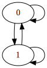

## Goals Today

* Showing what we've accomplished with Laura Humphrey over the past year
* Getting feedback on salty to better meet AFRL's needs

## Salty

<ul>
<li class="fragment fade-in">
A domain specific language for specifying GR(1) synthesis problems
</li>
<li class="fragment fade-in">
Aids specification writing through type-checking and sanity checking
</li>
<li class="fragment fade-in">
Generates Java and Python code from specifications
</li>
</ul>

## Roadmap

* Motivation
* Simple Example
* Syntax
* Sanity Checking
* Larger Example
* AMASE Integration
* Next Steps

# Motivation

## Slugs

Salty uses [slugs][slugs] to synthesize a state machine

## Why not use slugs directly?

* The specification language is extremely low-level
* No code generation support
* Difficult to diagnose unrealizable specifications

## Why use Salty?

* Synthesis tools are quite low-level
* Abstraction is useful
* A friendlier interface on slugs makes it a more useful tool for programmers
  and planning experts

# Salty Example

##

```salty
-- A simple specification
controller Example1 where

input a: Bool
output b: Bool

sys_trans
  a == b
```

<aside class="notes">
* This example constrains the output `b` to track the value of the environment
  variable `a`
</aside>

## Comments

Comments start with the `--` character sequence

```salty
-- A simple specification
```

<aside class="notes">
* Salty currently only supports single line comments
</aside>

## Controller Header

All specifications start with a `controller` header

```salty
controller Example1 where
```

<aside class="notes">
* Artifacts derived from this specification will be in the namespace `Example1`
* This will be covered a bit more when discussing syntax
</aside>

## State Variables

```salty
input a: Bool
output b: Bool
```

<aside class="notes">
* One input variable `a` that is required to be a boolean value
* One output variable `b` that is required to be a boolean value
* The type annotations on the declarations are required
* Both variables are uninitialized
* We'll go into more detail on state variables in the syntax section
</aside>

## Transition Constraint
The system is constrained to have the output variable `b` be the same as the
input variable `a`
```salty
sys_trans
  a == b
```

<aside class="notes">
* There are more constraints that can be specified than just `sys_trans`; we'll
  address them in more detail when talking about syntax
</aside>

## Generating Python

```bash
$ salty --python example1.salt
Writing Example1.py
```

<aside class="notes">
* This generates a single python class called `Example1`
* The class has one method `move`, which accepts a single boolean-valued input,
  and produces a single boolean valued output
* The input corresponds to the `a` variable of the spec, and the output
  corresponds to the `b` variable of the spec
</aside>

## Visualizing the Controller



<aside class="notes">
* Salty can output a picture of the state machine that was produced
</aside>

## Using the Controller

```python
>>> from Example1 import Example1
>>> x = Example1()
>>> x.move(True)
True
>>> x.move(False)
False
```
<aside class="notes">
* The arguments to the `move` function are the `input` variables from the
  controller, and the result is values of the `output` variables
* If only one output is defined, the result is a single value, if multiple
  outputs are defined, a dictionary is returned
</aside>

## Modifying the Controller

```salty
controller Example2 where

input a: Bool
output b: Bool

sys_trans
  a != b
```

<aside class="notes">
* Modify the specification to make the output always negate the input
</aside>

## Generating Python

```bash
$ salty --python example2.salt
Writing Example2.py
```

<aside class="notes">
* Generate python exactly as before
</aside>

## Using the Controller

```python
>>> from Example2 import Example2
>>> x = Example2()
>>> x.move(True)
False
>>> x.move(False)
True
```

<aside class="notes">
* Note that the output is now always the negated version of the input
</aside>

## Initial State Constraints

What if we want to constrain the controller to always start by outputting
`True`?

```salty
controller Example3 where

input a: Bool
output b: Bool = True

sys_trans
  a != b
```

<aside class="notes">
* Now the output variable `b` is constrained to have an initial value of `True`
</aside>

## Oops!
```bash
$ salty --python example3.salt
  Unrealizable
```

<aside class="notes">
* Constraining `b` led us to a situation where the environment could force the
  system to violate its safety property, `a != b`
</aside>

## Fixing the Problem

```salty
controller Example3 where

input a: Bool = False
output b: Bool = True

sys_trans
  a != b
```

<aside class="notes">
* The problem was that leaving `a` unconstrained allowed for an initial state
  where `a != b` was False
* Constraining `a` in the initial state resolves the problem
</aside>

## Generating Python

```bash
$ salty --python example3.salt
Writing Example3.py
```


# Basic Syntax

## Controller Declaration

```salty
controller Example1 where
«top-level declarations»
```

<aside class="notes">
* Names this unit of compilation
* The python class generated from this spec is named `Example1`
* Other top-level declarations are things like:
  - State variable declarations
  - Constraints on the environment or system
  - Macro definitions
  - Use of top-level macros
</aside>

## State Variables

```salty
input  «identifier» : «type» [= «expression»]
output «identifier» : «type» [= «expression»]
```

* `input` for environment variables
* `output` for system variables
* type annotation is required
* initial value is optional

<aside class="notes">
* Input variables are controlled by the environment
* Output variables are controlled by the system
</aside>


## Simple Expressions

```salty
e         : «ty» -- variables
True      : Bool -- constant True
False     : Bool -- constant False
e'        : «ty» -- the next value of expression `e`
f(True,e) : «ty» -- macro application
```
Expression examples, and their types

<aside class="notes">
* NOTE: this list is not exhaustive
* Type annotations here are for clarity, and aren't present in the actual
  syntax
* This list is not exhaustive
</aside>

## Logical Connectives
```
! e       : Bool -- negation
e1 /\  e2 : Bool -- conjunction
e1 \/  e2 : Bool -- disjunction
e1 ^   e2 : Bool -- exclusive or
e1 ->  e2 : Bool -- implication
e1 <-> e2 : Bool -- if and only if
```

<aside class="notes">
* All of the binary operations have type `Bool -> Bool -> Bool`
</aside>

## Exercise

Open up `boolean.salt`, and write an expression to relate the input variables to
the output variable

## Control Structures

``` salty
-- if-then-else
if e1 then e2 else e3
```

<div class="fragment fade-in">
An easier way to say:

```salty
(e1 -> e2) /\ (! e1 -> e3)
```
</div>


<aside class="notes">
* All arguments must have type `Bool`, as if-then-else is just desugared to
  conjunction and implication
</aside>

## Aggregate Operations

```salty
{ a1, .. , an } : Set «ty»  -- a set literal, all elements
                            -- have type `ty`
all      : Set Bool -> Bool -- set conjunction
any      : Set Bool -> Bool -- set disjunction
mutex    : Set Bool -> Bool -- set mutual exclusion
e <- set : Bool             -- set membership
```

<aside class="notes">
* Set is a type **constructor**, like a generic in Java
</aside>

## Conjunction and Disjunction
```salty
output search_A : Bool
output search_B : Bool
output search_C : Bool

sys_trans
  any { search_A, search_B, search_C }

sys_liveness
  all { search_A, search_B, search_C }
```

<aside class="notes">
* This specification fragment requires that at all times, at least one of the
  three output variables are true
* There must always be a future state where all output variables are true at the
  same time
</aside>

## Mutual Exclusion

```salty
output search_A : Bool
output search_B : Bool
output search_C : Bool

sys_trans
  mutex { search_A, search_B, search_C }
```

<aside class="notes">
* This specification fragment requires that only one of the three output state
  variables be true at any given time.
</aside>

## Set Membership

```salty
output val: Bool

sys_trans val <- { True, False }
```

<aside class="notes">
* Desugars to a disjunction of equalities with the variable, and the members of
  the set
* This (simplistic) example states that the value of `val` must be one of `True`
  or `False`
* The set membership construction is more useful when using datatypes other than
  Bool
</aside>

## Constraints

```salty
sys_init     «exprs» -- system initialization
sys_trans    «exprs» -- system safety property
sys_liveness «exprs» -- system liveness property

env_init     «exprs» -- initial environment assumptions
env_trans    «exprs» -- environment safety assumptions
env_liveness «exprs» -- environment liveness assumptions
```

<aside class="notes">
* We've already seen `sys_trans`
* The top-level isn't the only case where constraints can be specified, we'll
  get into that more in the `macros` section
* The `exprs` argument for all the constraints can be one or more expressions,
  separated by newlines, and is interpreted as conjunction
</aside>


## Initialization Constraints

* `sys_init` - constraints must be satisfied by the system in the initial state
* `env_init` - constraints are assumptions about environmental variables in the
initial state

## Initialization Example

```salty
input a: Bool = False
output b: Bool = True
```
<div class="fragment fade-in">
is the same as

```salty
input a: Bool
output b: Bool

env_init a == False
sys_init b == True
```
</div>

## Transition Constraints

* `sys_trans` - constraints that must be true in every state
* `env_trans` - assumptions that can be made about the environment
  variables in every state

## Liveness Constraints

* `sys_liveness` - constraints that must always be true at some state in the
  future
* `env_liveness` - constraints that the environment will always eventually
  satisfy

## Layout
Groups of declarations are specified by vertical alignment
```salty
sys_trans e
sys_trans x
          y
sys_trans
  a && b
env_trans
  d == e
  d' == True
```

<aside class="notes">
* The `sys_trans` and `env_trans` declarations are lined up, forming two
  declarations
* This extends to all top-level declarations, and all constraint definitions
</aside>

## Layout Parse Error

```salty
1| controller Example where
2| input a : Bool
3| input b : Bool
4| env_init
5|   a == True
6|  b == False
```

```bash
$ salty example.salt
-- [error] :6,2-6,2 ------------------------------------------------------------
  Parse error
```

<aside class="notes">
* This example fails to parse, as line 5 sets the indent for the `env_init`
  block to be 2
* Line 6 is indented to a level of 1, which doesn't line up with the rest of the
  expressions in the `env_init` block, thus a parse error is generated
</aside>

## Exercise

Open up `traffic-light.salt`

# Enumerations

## Syntax

```salty
enum «Name» = «Name_1» | ... | «Name_n»
```

<div class="fragment fade-in">
For example

```salty
enum Location = Field | Forest | Fence
```
</div>

## Mutual Exclusion

```salty
input field: Bool
input forest: Bool
input fence: Bool
env_trans
  mutex { field, forest, fence }
```

<div class="fragment fade-in">
Enumerations nicely capture mutually exclusive values

```salty
enum Location = Field | Forest | Fence
input loc: Location
```
</div>

## Enumeration Advantages

* A more succinct specification
* More optimized state machine

<aside class="notes">
* Giving more information to salty in the form of variables that have
  enumeration types can allow for a simpler synthesis problem
</aside>

## Exercise

Let's modify `traffic-light.salt` to use an enumeration instead of three boolean
variables

# Macros

## Syntax

```salty
def «name»(a_1, ..., a_n) = «expr»
def «name»(a_1, ..., a_n) = «constraints»
```

<aside class="notes">
* The body of a macro can either be a single expression, or layout-separated
  uses of the constraint declarations
* Macros are also subject to layout -- the end of a macro is either the end of
  the file, or another declaration that's aligned with the `def` keyword
</aside>

## Naming Common Patterns

```salty
def cond_behavior(cmd, heath, b, r) =
  (command == cmd /\ all heath)
    -> (behavior == b /\ region == r)
```

Expression macro that defines the core of a conditional behavior

<aside class="notes">
* `behavior` is a free variable in this definition
* While no types are mentioned in the definition of `cond_behavior`, they are
  inferred
</aside>

## Typed Macros

* Macros in salty are strongly-typed, but the types are inferred
* All uses of a macro are checked for consistency

<div class="fragment fade-in">
```salty
...
sys_trans
  if target
     then cond_behavior(SearchTrack, { fuel }, Track, Forest)
     else cond_behavior(True, { fuel }, Search, Forest)
...
```

```
-- [error] macro-error.salt:20,25-20,29 ----
  Unable to unify the types:
    * Command
    * Bool
```
</div>

<aside class="notes">
* The first parameter to `cond_behavior` is inferred as having type Command, but
  it is used with the constant `True`, yielding the type error
</aside>


## Naming Common Patterns

```salty
def play(cmd, b1, r1, m, b2, r2, h) =
  sys_trans
    if m then cond_behavior(cmd, h, b2, r2)
         else cond_behavior(cmd, h, b1, r1)

def cond_behavior(cmd, heath, b, r) =
  (command == cmd /\ all heath)
    -> (behavior == b /\ region == r)
```

Constraint macro that defines a switching behavior

<aside class="notes">
* Example taken from the play library skeleton in p2ps-amase-plugin
</aside>

## Using Macros

* Expression macros can be used anywhere an expression is expected
* Constraint macros can be used as a top-level declaration, or in other
  constraint macros

## Exercise

Open up `enum-macro.salt`

# Code Generation

## Python

As we've seen already, python classes can be generated by passing the `--python`
flag to salty

```bash
$ salty --python enum.salt
Writing Enum.py
```

<p class="fragment fade-in">
Let's examine `Enum.py`
</p>

<aside class="notes">
* The `Location` `enum` is generated as an inner class of `Example1` in the
  Python case
</aside>

## Java

Java classes can be generated by passing the `--java` flag, which requires a
package string

```bash
$ salty --java=com.example enum.salt
Writing com/test/Enum.java
Writing com/test/InputException.java
Writing com/test/enums/Location.java
```

<p class="fragment fade-in">
Let's compare `Enum.java` to `Enum.py`
</p>

<aside class="notes">
* In this case, you can see that the `Location` java `enum` was generated
  explicitly, and placed in the `com.test.enums` `namespace`
</aside>

## Dot

A dot representation of the state machine can be produced by using the `--dot`
flag

```salty
$ salty --dot enum.salt
Writing Enum.dot
$ dot -Tsvg -o enum.svg enum.dot
```

## Enum Diagram

![enum-svg]

## Exercise

* Generate dot from `traffic-light.salt`
* Produce SVG from the dot file

# Sanity Checking

##
It's easy to write specifications with internal errors

```
sys_trans a == True
...
sys_trans a == False
```

##

The sanity checker can help here

```bash
$ salty sanity.salt
-- [error] ---------------------------------
  System safety constraints are never satisfiable
    * system safety constraint at :8,11-8,20
    * system safety constraint at :9,11-9,21
```

## Limitations

* Sanity checking is a lightweight analysis
* Unable to detect specifications that can't satisfy liveness properties
* Meant to aid debugging

# Larger Example

##

Open up the `play-calling.salt` file

# AMASE Integration

## Architecture

![amase-integration]

## Generate Setup Config

![amase-integration-setup-config]

## Generate Setup Config

```bash
$ run/gen-config.py example.salt
Gathering annotations...
Translating annotations...
Writing plays.xml...
Done!
```

<aside class="notes">
* This command generates an xml file that describes all of the valid plays and
  contingencies that the controller can support
</aside>

## Design a Scenario

![amase-integration-scenario]

## Design a Scenario

```bash
$ ant run-setup
```

<div class="fragment fade-in">
Save the scenario xml to use in the next step
</div>

## Generate a Scenario Driver

![amase-integration-driver]

## Generate a Scenario Driver

```bash
$ run/gen-support.py example.salt scenario.xml
Gathering annotations from example.salt...
Loading scenario description from ../auto_code.xml...
Generating controllers...
Writing dist/Controller1.py
Writing dist/Controller2.py
Writing dist/Controller3.py
Generating scenario driver (dist/driver.py)...
Copying PyMASE.py to dist/PyMASE.py...
Copying search.py to dist/search.py...
Generating LMCP messages for python (src-gen/python)...
Copying afrl tree (src-gen/python/afrl)...
Copying lmcp tree (src-gen/python/lmcp)...
Copying scenario xml...
Output is located in: dist
```

## Customize the Scenario Driver

```bash
$ vim dist/driver.py
```

<div class="fragment fade-in">
Stubs in `driver.py` are marked with `TODO` comments
</div>

## Run the Scenario

![amase-integration-run]

## Run the Scenario

```bash
$ ant run-amase &
$ python dist/driver.py
```

# Next Steps

## Feedback

We're looking for feedback so that we can improve salty

## Future Work

* Compositional multi-vehicle scenarios
* Library development for play calling
* Improve sanity checking
* Improved code generation
* Improved AMASE/UxAS integration
* Other backends?

## Resources

* [github][salty]
* [documentation][salty-docs]
* [examples][salty-examples]


[salty]: https://github.com/GaloisInc/salty
[salty-docs]: https://github.com/GaloisInc/salty/blob/master/doc/salty.md
[salty-examples]: https://github.com/GaloisInc/salty/blob/master/examples
[slugs]: https://github.com/VerifiableRobotics/slugs
[amase-integration]: diagrams/diagrams.001.png
[amase-integration-setup-config]: diagrams/diagrams.002.png
[amase-integration-scenario]: diagrams/diagrams.003.png
[amase-integration-driver]: diagrams/diagrams.004.png
[amase-integration-run]: diagrams/diagrams.005.png
[enum-svg]: enum.svg
[example1-svg]: Example1.svg
